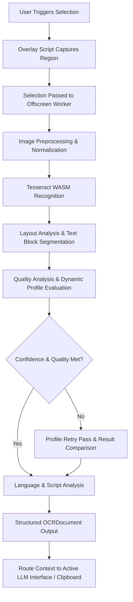

# PromptLens

> **Capture. Understand. Prompt.**

[](LICENSE)
[](https://www.typescriptlang.org/)
[](https://wxt.dev/)
[](https://developer.chrome.com/docs/extensions/mv3/intro/)

PromptLens is a privacy-first Chrome Extension designed to transform screen regions into clean, structured, AI-ready context using in-browser WebAssembly OCR.

Captured screen selections are processed locally in memory without automatic disk saving.

<!-- Screenshot Placeholder: Main PromptLens Selection Overlay in Action -->
<!--  -->

---

## Product Overview

Interacting with AI models (ChatGPT, Claude, VS Code AI, GitHub Copilot) often requires copying text from non-selectable UI regions—code snippets in videos, terminal output in documentation, error tracebacks in screenshots, or multi-column layout blocks.

**PromptLens** serves as a responsive bridge between visual information and AI interfaces. Powered by a local WebAssembly OCR engine, PromptLens extracts text, analyzes layout structure, identifies syntax types (JSON, Markdown, Terminal, YAML), and formats context for LLM prompts.

---

## Key Features

- 🔒 **Local WebAssembly OCR**: Performs text extraction locally within the browser using bundled WebAssembly components.
- ⚡ **In-Memory Processing**: Processes visual selections in memory without saving temporary image files to your local disk.
- 🎯 **Multi-Stage OCR Engine**: Includes automated image preprocessing, layout analysis, structural text block segmentation, and quality evaluation.
- 🔄 **Adaptive Profile Selection & Retries**: Evaluates content characteristics and applies dynamic profiles for code, documents, terminal output, and structured data.
- 🌐 **Language & Script Analysis**: Provides lightweight script detection and language candidate evaluation across common character sets.
- 🧩 **AI Context Integration**: Routes formatted context directly to active AI chat interfaces or copies to your clipboard.

---

## Core Principles

| Principle | Description |
| :--- | :--- |
| 🔒 **Privacy First** | Designed to process images locally within the browser without cloud OCR dependencies. |
| ⚡ **Speed Matters** | Optimized for responsive, in-memory execution. |
| 📁 **Zero Screenshot Clutter** | Selections are processed in memory and released after extraction. |
| 🛠️ **Developer Friendly** | Modular architecture built with TypeScript and extensible pipeline registries. |

---

## System Flow



---

## Architecture Summary

PromptLens uses a pipeline architecture where discrete processing stages operate on a shared context:

1. **Analysis & Preprocessing**: Calculates image metrics and applies quality enhancement filters (upscaling, adaptive thresholding, deskewing, denoising).
2. **WASM Recognition**: Interfaces with the offline Tesseract WebAssembly engine.
3. **Layout & Block Analysis**: Segments spatial regions, classifies text blocks, and detects table structures.
4. **Quality & Profile Retries**: Measures text quality, evaluates syntax integrity, and applies targeted profile passes when needed.
5. **Language & Statistics**: Evaluates script distribution, scores language candidates, and records execution metrics.

> For complete architectural specifications and flowcharts, see [docs/architecture.md](docs/architecture.md).

---

## Supported Content Types

PromptLens automatically detects and formats:

- **Source Code**: Monospaced snippets in C, C++, Java, Python, JavaScript, TypeScript, Rust, Go, etc.
- **Structured Data**: JSON payloads and YAML configuration blocks.
- **Terminal Output**: Shell prompts, CLI logs, error tracebacks (`npm`, `git`, `docker`, `cargo`).
- **Markdown & Web Documents**: Formatted headers, lists, code fences, and HTML blocks.
- **Prose & Documentation**: Technical articles, paper snippets, and documentation layouts.

---

## Installation & Setup

### Prerequisites

- [Node.js](https://nodejs.org/) (v18.0.0 or higher)
- [npm](https://www.npmjs.com/) (v9.0.0 or higher)
- Google Chrome or compatible Chromium browser

### Local Setup

1. **Clone the Repository**:
   ```bash
   git clone https://github.com/Monish0621/LLM-Context-Capture.git
   cd LLM-Context-Capture
   ```

2. **Install Dependencies**:
   ```bash
   npm install
   ```

3. **Start Development Build**:
   ```bash
   npm run dev
   ```

4. **Load Unpacked Extension in Chrome**:
   - Navigate to `chrome://extensions/`.
   - Enable **Developer mode** (top-right toggle).
   - Click **Load unpacked**.
   - Select `.output/chrome-mv3` directory.

---

## Browser Compatibility

PromptLens is developed and tested on Google Chrome (Manifest V3). Other Chromium-based browsers may be compatible depending on support for the required extension APIs.

---

## Technology Stack

- **Extension Framework**: [WXT Framework](https://wxt.dev/) (Manifest V3)
- **UI Component Library**: React 18 + TailwindCSS
- **Primary OCR Engine**: [Tesseract.js WASM](https://github.com/naptha/tesseract.js) (Offline WebAssembly core)
- **Language & Runtime**: TypeScript 5.0+, Vite 8.1
- **Graphics & Processing**: Offscreen HTML5 Canvas & ImageData API

---

## Repository Structure

```
.
├── entrypoints/              # Extension entry points (background, content, overlay, popup, offscreen)
├── utils/
│   ├── ocrPipeline/          # Modular 12-stage OCR Pipeline architecture
│   └── llmInjectors.ts       # Context injection drivers for AI web interfaces
├── public/                   # Extension icons & local Tesseract WASM binary assets
├── docs/                     # Architecture, privacy policy, and FAQ documentation
├── package.json
└── wxt.config.ts             # WXT extension build configuration
```

---

## Documentation

- 📐 **[Architecture Guide](docs/architecture.md)**: Technical specifications of the pipeline.
- 🔒 **[Privacy Policy](docs/privacy-policy.md)**: Details on local processing and Chrome extension permissions.
- ❓ **[FAQ](docs/faq.md)**: Frequently asked questions for developers and users.
- 🤝 **[Contributing Guidelines](CONTRIBUTING.md)**: How to build and submit pull requests.
- 📜 **[Changelog](CHANGELOG.md)**: Release notes.

---

## Privacy & Security

PromptLens is designed around local processing:

- **Local Execution**: PromptLens itself does not transmit captured screenshots or extracted OCR text to external servers during normal operation.
- **No Cloud Dependencies**: Text extraction is performed locally inside your browser using bundled WebAssembly binaries.
- **In-Memory Processing**: Screen selections exist in memory buffers during processing and are released after extraction.

---

## Contributing

We welcome community contributions. Please review our [CONTRIBUTING.md](CONTRIBUTING.md) guide before submitting pull requests.

---

## License

PromptLens is released under the [MIT License](LICENSE).
