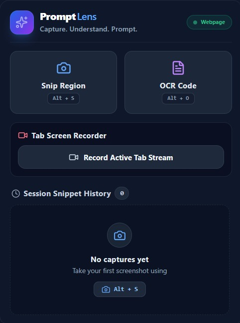
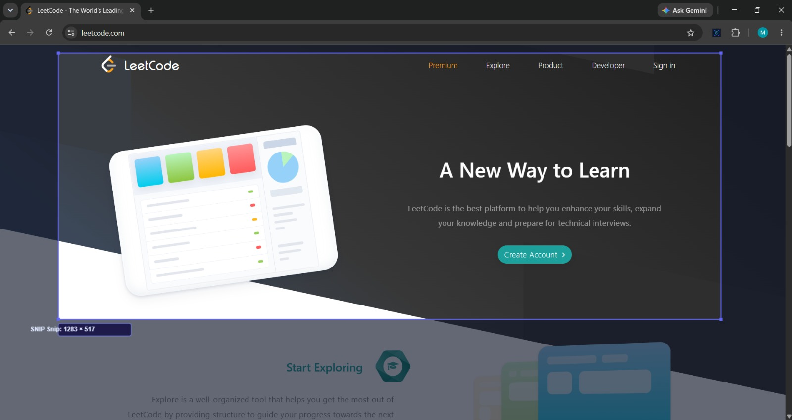
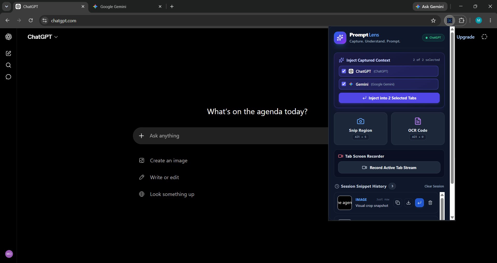
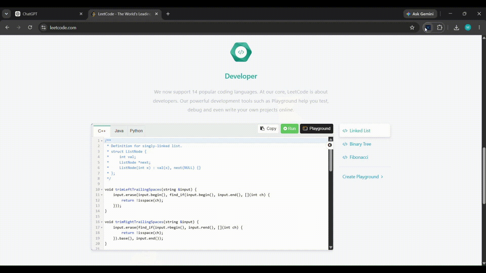

<div align="center">

# PromptLens

> **Capture. Understand. Prompt.**

[](LICENSE)
[](https://www.typescriptlang.org/)
[](https://wxt.dev/)
[](https://developer.chrome.com/docs/extensions/mv3/intro/)

<br />

<p align="center">
  
</p>

</div>

Capture screenshots, extract text locally using OCR, record browser workflows, and send structured context directly to ChatGPT, Claude, Gemini, Grok, and Perplexity.

⭐ **Local OCR** &nbsp;|&nbsp; 🎥 **Screen Recording** &nbsp;|&nbsp; ⚡ **AI Injection** &nbsp;|&nbsp; 🔒 **Privacy First** &nbsp;|&nbsp; 📋 **Session History**

---

## Why PromptLens?

Working with AI assistants requires transferring code snippets, terminal outputs, error tracebacks, or structured data from non-selectable UI regions like video tutorials, technical documentation, or CLI tools.

Manual typing leads to syntax errors, while saving raw screenshots clutter your disk and risk uploading sensitive data to cloud servers.

**PromptLens** serves as a responsive, privacy-first bridge between your screen and AI interfaces. Powered by an offline WebAssembly OCR engine, PromptLens extracts structured text locally, classifies syntax, and routes context straight to active AI tabs with zero server transmissions.

---

## Features

### 🔍 Local WebAssembly OCR
Extracts text locally within your browser using a bundled WebAssembly engine. Features dynamic profile retries for C++, Python, TypeScript, JSON and YAML outputs.

### 🎥 Browser Tab Screen Recording
Record tab video streams with unlimited duration and a lightweight floating controller for seamless AI video analysis workflows.

### ⚡ One-Click AI Context Routing
Automatically detects open AI tabs (ChatGPT, Claude, Gemini, Grok, Perplexity) and routes formatted prompt payloads using an interactive Share Sheet overlay.

### 🔒 Privacy-First Architecture
100% in-browser processing. Visual selections exist only in temporary memory buffers and are purged immediately after extraction.

### 📋 Session Snippet History
Access, re-copy, or dispatch recent OCR extractions and video clips directly from the extension dashboard during your active session.

---

## Screenshots & Demos

### 1. Main Dashboard & Workflow

<p align="center">
  
</p>
*PromptLens popup showcasing the complete capture workflow.*

---

### 2. Precision Region Selection



*Select exactly the content you need from any webpage.*

---

### 3. Multi-Tab AI Injection



*Send structured context directly into supported AI assistants.*

---

### 4. Local WebAssembly OCR Demo


*Watch PromptLens extract structured text locally using WebAssembly OCR.*

---

### 5. Tab Screen Recording Demo


*Record browser workflows and prepare them for AI-assisted analysis.*

---

## Keyboard Shortcuts

| Shortcut | Description |
| :--- | :--- |
| <kbd>Alt</kbd> + <kbd>S</kbd> | Trigger visual screenshot region selection overlay |
| <kbd>Alt</kbd> + <kbd>O</kbd> | Trigger visual selection overlay for local OCR text extraction |
| <kbd>Esc</kbd> | Cancel active selection overlay or close Share Sheet panel |

---

## Installation & Setup

### Prerequisites

- [Node.js](https://nodejs.org/) (v18.0.0 or higher)
- [npm](https://www.npmjs.com/) (v9.0.0 or higher)
- Google Chrome or Chromium-based browser

### Local Setup

1. **Clone the Repository**:
   ```bash
   git clone https://github.com/Monish0621/PromptLens.git
   cd PromptLens
   ```

2. **Install Dependencies**:
   ```bash
   npm install
   ```

3. **Start Development Server**:
   ```bash
   npm run dev
   ```

4. **Load Unpacked Extension in Chrome**:
   - Open `chrome://extensions/`
   - Enable **Developer mode** (top-right toggle)
   - Click **Load unpacked** and select the `.output/chrome-mv3` directory

---

## Architecture Overview

PromptLens is built on Chrome Manifest V3 using an event-driven, decoupled worker model:

- **Popup Dashboard (`React 18 + TailwindCSS`)**: Lightweight extension control panel.
- **Background Service Worker**: Tab registry manager and state router.
- **Offscreen Processing Context**: Isolated sandbox for Tesseract WebAssembly engine execution and MediaRecorder streams.
- **Content Overlay Scripts**: Interactive canvas selection tools, floating recording controller, and Share Sheet.

> For detailed stage specifications, sequence diagrams, and pipeline contracts, see the **[Architecture Guide](docs/architecture.md)**.

---

## Documentation

- 📐 **[Architecture Specification](docs/architecture.md)**: Deep dive into the 12-stage OCR pipeline and MV3 message routing.
- 🔒 **[Privacy Policy](docs/privacy-policy.md)**: Full breakdown of local execution guarantees and browser permissions.
- ❓ **[FAQ](docs/faq.md)**: Frequently asked questions for users and contributors.
- 🤝 **[Contributing Guidelines](CONTRIBUTING.md)**: Local build and pull request guidelines.
- 📜 **[Changelog](CHANGELOG.md)**: Project version history.

---

## Privacy & Security

- **Complete Local Execution**: PromptLens processes visual captures entirely within your browser context.
- **Zero Remote Transmissions**: No screenshots, OCR extractions, or recordings are sent to external analytics or remote servers.
- **In-Memory Buffering**: Captured screen regions are held temporarily in memory and released immediately after extraction.

For complete details, review our **[Privacy Policy](docs/privacy-policy.md)**.

---

## License

PromptLens is open-source software licensed under the [MIT License](LICENSE).
