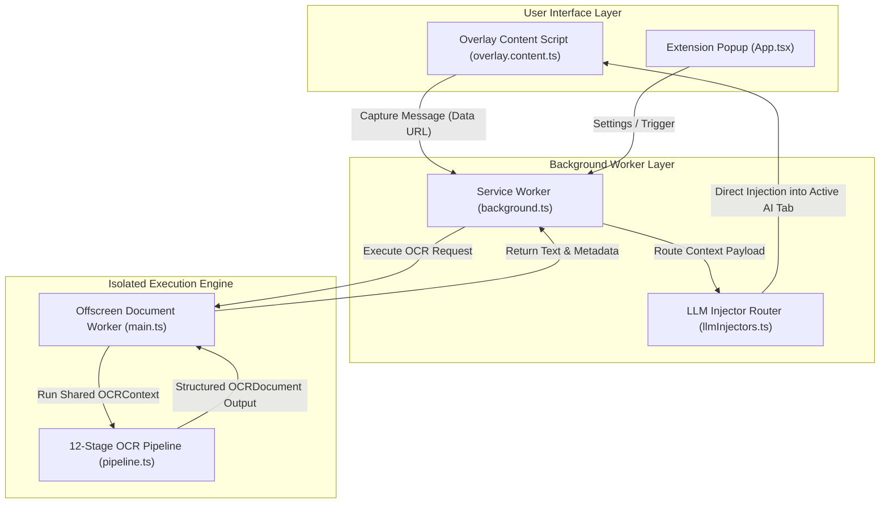

# PromptLens Architecture Specification

This document provides a comprehensive technical overview of the **PromptLens** architecture, pipeline stages, and design principles.

---

## High-Level System Architecture

PromptLens is structured around an event-driven, decoupled Chrome Manifest V3 architecture. Image processing and text recognition are executed within isolated browser worker contexts to maintain responsive UI interactions and local processing.



---

## The 12-Stage OCR Pipeline

The core intelligence of PromptLens resides in its modular 12-stage pipeline (`utils/ocrPipeline/pipeline.ts`). The orchestrator initializes a mutable `OCRContext` and passes it sequentially through each stage.

```mermaid
flowchart LR
    S1["1. Analysis"] --> S2["2. Preprocess"]
    S2 --> S3["3. Recognition"]
    S3 --> S4["4. Advanced Recognition"]
    S4 --> S5["5. PostProcess"]
    S5 --> S6["6. Quality Analysis"]
    S6 --> S7["7. Profile Selection"]
    S7 --> S8["8. Retry Engine"]
    S8 --> S9["9. Confidence"]
    S9 --> S10["10. Language Intelligence"]
    S10 --> S11["11. Correction"]
    S11 --> S12["12. Statistics"]
```



---

## Detailed Stage Responsibilities

### 1. Capture & AnalysisStage
- **Responsibility**: Calculates initial image dimension metrics, aspect ratios, color space properties, and baseline metadata.
- **Input**: Raw canvas image Data URL.
- **Output**: `ctx.metadata` (`width`, `height`, `aspectRatio`, `estimatedDensity`).

### 2. PreprocessStage (Filter Registry Engine)
- **Responsibility**: Enhances raw image quality prior to OCR using a priority-ordered filter runner (`FilterRunner`).
- **Filters Executed**:
  1. `TrimTransparentBorders` (priority 100): Trims empty padding around selection.
  2. `SmartUpscale` (priority 210): Upscales small text selections (< 600px) using canvas bicubic interpolation.
  3. `AdaptiveGrayscale` (priority 220): Converts RGB pixel buffers to luminance grayscale.
  4. `ContrastEnhancement` (priority 300): Performs contrast stretching and percentile histogram normalization.
  5. `AdaptiveThreshold` (priority 410): Applies Bradley-Roth local adaptive threshold binarization.
  6. `MedianDenoise` (priority 450): Removes salt-and-pepper background noise.
  7. `MorphologicalCleanup` (priority 500): Connects broken character strokes.
  8. `DeskewFilter` (priority 550): Estimates and corrects document rotation skew angle.
  9. `SharpenFilter` (priority 600): Applies unsharp masking to enhance character edges.

### 3. RecognitionStage (Tesseract WASM Adapter)
- **Responsibility**: Interfaces with the offline Tesseract WebAssembly driver via the `OCREngine` dependency-injection interface.
- **Output**: Raw OCR text string (`ctx.rawText`), character/word bounding coordinates (`ctx.wordData`), and engine metadata.

### 4. AdvancedRecognitionStage (Structured Extraction)
- **Responsibility**: Performs geometric spatial analysis and canonical document compilation without modifying raw text.
- **Modules Executed**:
  - `RegionAnalyzer`: Groups word bounding boxes into spatial regions.
  - `LayoutAnalyzer`: Classifies layout structure (`code`, `terminal`, `document`, `table`, `multi_column`, `single_column`).
  - `TextBlockAnalyzer`: Segments text into typed blocks (`paragraph`, `heading`, `code`, `terminal`, `table`, `quote`).
  - `TableAnalyzer`: Detects grid alignments and pipe/ASCII table structures.
  - `ReadingOrderResolver`: Resolves top-down and column-aware logical reading sequences.
  - `RecognitionMerger`: Compiles the canonical `OCRDocument` model.

### 5. PostProcessStage
- **Responsibility**: Normalizes line endings, strips extraneous control characters, formats markdown code fences, and standardizes indentation whitespace.

### 6. QualityAnalysisStage (Quality Analysis Engine)
- **Responsibility**: Evaluates overall text quality using non-destructive analysis modules:
  - `CharacterAnalyzer`: Measures alphanumeric ratio, punctuation distribution, and garbage symbol density.
  - `StructureAnalyzer`: Checks syntax fence balance (` ``` `, `{}` , `[]`, `<>`) and line length uniformity.
  - `ContentAnalyzer`: Classifies content type (`code`, `json`, `yaml`, `terminal`, `prose`, `html`).
- **Output**: `ctx.qualityReport` containing overall score (0–100), penalties, and warnings.

### 7. ProfileSelectionStage (Dynamic Profile Selection)
- **Responsibility**: Evaluates text and image characteristics to select optimal OCR retry profiles (`CODE`, `DOCUMENT`, `JSON`, `TERMINAL`, `MARKDOWN`, `LOW_RESOLUTION`, `HIGH_CONTRAST`) for low-confidence results.

### 8. RetryDecisionStage (Intelligent Retry Engine)
- **Responsibility**: Orchestrates fallback retry passes managed by `RetryBudget` and `RetryStrategy`.
- **Execution**: If initial confidence or quality score falls below threshold, executes targeted profile passes and uses `RetryComparator` to pick the winning result.

### 9. ConfidenceStage
- **Responsibility**: Computes mean aggregate confidence scores across word-level and block-level extractions.

### 10. LanguageStage (Language Intelligence Engine)
- **Responsibility**: Evaluates natural language candidates using lightweight character classification.
- **Execution**: Runs `ScriptDetector` classifying text into 8 Unicode block categories (`Latin`, `Devanagari`, `Kannada`, `Tamil`, `Telugu`, `Arabic`, `CJK`, `Mixed`) and scores candidate languages against `LanguageRegistry`.

### 11. CorrectionStage
- **Responsibility**: Applies safe, non-destructive post-processing character corrections for common OCR misreadings.

### 12. StatisticsStage
- **Responsibility**: Aggregates timing breakdowns (`processingTimeMs`, `recognitionTimeMs`, `preprocessingTimeMs`) and final pipeline statistics (`ctx.statistics`).

---

## Fault Tolerance & Non-Blocking Design

PromptLens enforces strict resilience contracts across all stages:

1. **Non-Throwing Pipeline Stages**: Individual stage failures log diagnostic warnings to `ctx.warnings` and return `ctx` intact.
2. **Raw OCR Output Protection**: Advanced layout extraction and post-processing steps operate additively. Raw OCR text remains accessible as a fallback at all times.
3. **Memory Isolation**: Canvas objects and ImageData buffers created during preprocessing are explicitly garbage-collected following stage execution.
